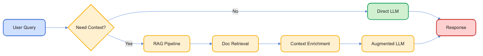
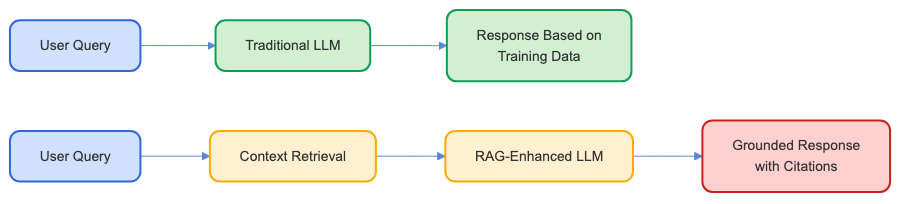

# Retrieval-Augmented Generation (RAG) Workshop

A step-by-step guide to building and understanding RAG systems
RAGシステムの構築と理解のためのステップバイステップガイド

by Davide Pasca

(2025/03)

---

# What is RAG?

**Retrieval-Augmented Generation (RAG)**:

- Fast fuzzy search + LLM intelligence
- 高速なあいまい検索とLLMの知能

**Benefits:**
- Extends knowledge of LLM to any document database
- LLMの知識を任意のドキュメントデータベースに拡張
- Language model can be small
- 言語モデルは小さくても良い
- Reliable responses (can mention sources)
- 信頼性のある応答（ソースを言及可能）

---

# Workshop Overview

A progressive approach to understanding and implementing RAG:
RAGを理解し実装するための段階的アプローチ

1. **Basic Chat** - Simple AI chat (no RAG) (基本的なチャット - シンプルなAIチャット（RAGなし）)
2. **Function Calling** - AI chat with function-calling (関数呼び出し付きAIチャット)
3. **Basic RAG** - Basic RAG pattern (基本的なRAGパターン)
4. **Function-Based RAG Decision** - RAG with function-calling (関数呼び出しを用いたRAG)
5. **Agentic RAG Decision** - RAG with agents (エージェントを用いたRAG)

---

# Stage 1: Basic Chat

**Objective:** Create a simple chat interface using OpenAI API
シンプルなチャットインターフェースをOpenAI APIを使用して作成する

**Features:**
- Chat with Express server and REST API - ExpressサーバーとREST APIでのチャット
- Using Ollama via OpenAI API compatible endpoint (OpenAI API互換エンドポイントを介したOllamaの使用)

**Key Concepts:**
- De-facto standard "completions" API by OpenAI (OpenAIによる事実上の標準「completions」API)
- Access to Ollama models via this endpoint (このエンドポイントを通じたOllamaモデルへのアクセス)
---

# Stage 1: Basic Chat (continued)

1. Create a list of messages between "user" and "assistant"
  「ユーザー」と「アシスタント」の間のメッセージリストを作成
2. On user input, add new "user" messages to the history
  ユーザー入力時に新しい「ユーザー」メッセージを履歴に追加
3. Call Completions API with all messages
  すべてのメッセージでCompletions APIを呼び出す
4. Get "assistant" response and add it to the history
  「アシスタント」の応答を取得して履歴に追加
5. Wait for next user input and repeat...
  次のユーザー入力を待って繰り返す...

---

# Stage 2: Function Calling

**Objective:** Enhance the chat with function calling capabilities
関数呼び出し機能を備えたチャットを強化する

```javascript
// Define a function for the LLM to call
const getMovieRatingFunction = {
  name: "get_movie_rating",
  description: "Get the rating for a movie",
  parameters: {
    type: "object",
    properties: {
      movieTitle: {
        type: "string",
        description: "The title of the movie"
      }
    },
    required: ["movieTitle"]
  }
};
```

**Key Concepts:**
- OpenAI function calling
- Structuring functions for LLM use
- Parsing and handling function responses

---

# Stage 3: Basic RAG

**Objective:** Implement the core RAG pattern from scratch
コアRAGパターンをゼロから実装する


**Features:**
- Document loading and processing
- Vector embedding and storage
- Context retrieval and prompt augmentation

**Key Concepts:**
- Document chunking and indexing
- Semantic search and similarity
- Context window management

---

# Stage 4: Function-Based RAG Decision

**Objective:** Use function-calling to intelligently decide when to use RAG
関数呼び出しを使用してRAGを使用するタイミングをインテリジェントに決定する

```javascript
// Define RAG search tool
const searchKnowledgeBaseFunction = {
  name: "search_knowledge_base",
  description: "Search through the knowledge base for relevant information",
  parameters: {
    type: "object",
    properties: {
      query: {
        type: "string",
        description: "The query to search for"
      }
    },
    required: ["query"]
  }
};
```

**Key Concepts:**
- Meta-reasoning with LLMs
- Hybrid processing pipelines
- Optimizing for relevance and performance

---

# Stage 5: Agentic RAG Decision

**Objective:** Use an agent to decide when to use RAG
エージェントを使用してRAGを使用するタイミングを決定する


**Features:**
- Initial query analysis completion
- Conditional context augmentation
- Multiple reasoning steps

**Key Concepts:**
- Multi-stage prompting
- Building more flexible RAG systems
- Agent-based decision making

---

# Implementation Architecture

<div style="display: flex; justify-content: center; align-items: center;">
  
</div>

---

# Example Application

<div style="display: flex; justify-content: center; align-items: center;">
  
</div>

Our sample document "The Lost Signal of Elara-7" demonstrates how RAG enhances LLM responses:
サンプルドキュメント「The Lost Signal of Elara-7」は、RAGがLLMの応答をどのように強化するかを示しています：

- Without RAG: Generic responses based on training data
  RAGなし：トレーニングデータに基づく一般的な応答
- With RAG: Specific responses incorporating details about:
  RAGあり：以下の詳細を組み込んだ具体的な応答：
  - Mining colony on Elara-7
    エララ-7の採掘コロニー
  - Chief Engineer Mara Kade's last message
    チーフエンジニアのマラ・ケイドの最後のメッセージ
  - The mysterious crystalline structures
    神秘的な結晶構造
  - The Icarus Dawn investigation team
    イカロス・ドーン調査チーム

---

# Getting Started

```bash
# Clone this repository
git clone https://github.com/yourusername/RAGTutorial.git

# Get the required Ollama models
ollama pull qwen2.5:3b
ollama pull nomic-embed-text

# Navigate to an example and install dependencies
cd 01-basic-chat
npm install

# Start the server
npm start

# Open http://localhost:3000 in your browser
```

---

# Thank You!

**Resources:**
- [OpenAI API Documentation](https://platform.openai.com/docs/)
- [Ollama Project](https://ollama.ai/)
- [Node.js Documentation](https://nodejs.org/en/docs/)

**Contact:**
Davide Pasca
- [davide@newtypekk.com](mailto:davide@newtypekk.com)
- [x.com/109mae](https://x.com/109mae)