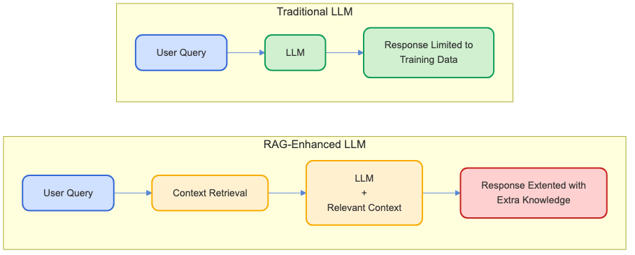
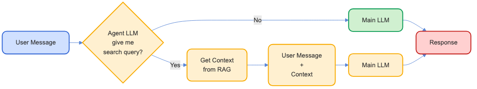

# Retrieval-Augmented Generation (RAG) Workshop
# 検索強化生成（RAG）ワークショップ

> A step-by-step guide to building and understanding RAG systems
> RAGシステムの構築と理解のためのステップバイステップガイド

 
 

by Davide Pasca

v 1.1

<a href="https://github.com/dpasca/RAGTutorial">https://github.com/dpasca/RAGTutorial</a>

---

# Quickstart

| | | |
|---|---|---------------|
| 1 | See the requirements | [English](workshop_requirements_rag_en.txt) or [日本語](workshop_requirements_rag_ja.txt) |
| 2 | Clone this repo | `git clone git@github.com:dpasca/RAGTutorial.git` |
| 3 | Get models | `ollama pull qwen2.5:3b` `ollama pull nomic-embed-text` |
| 4 | Install common dependencies | `cd common && npm install` |
| 5 | Go to a lesson | `cd ../01-basic-chat` |
| 6 | Install dependencies | `npm install` |
| 7 | Start the server | `npm start` |
| 8 | Open browser | `http://localhost:3000` |

---

# What is RAG?

**Retrieval-Augmented Generation (RAG) `-` 検索強化生成（RAG）**
- Fast fuzzy search + LLM intelligence `-` 高速なあいまい検索とLLMの知能

**Why using RAG?**
- Extends knowledge of LLM to any document database
  LLMの知識を任意のドキュメントデータベースに拡張
- The Language Model can be small (SML instead of LLM)
  言語モデルは小さくてもよい（LLMではなくSML）
- Reliable responses (can mention sources)
  信頼性のある応答（ソースを言及可能）

---

# Workshop Overview

A progressive approach to understanding and implementing RAG:
RAGを理解し実装するための段階的アプローチ：

1. **Basic AI Chat** `-` 基本的なAIチャット
2. **Function Calling** `-` 関数呼び出し
3. **Basic RAG** `-` 基本的なRAG
4. **Function Calling for RAG** `-` RAGのための関数呼び出し
5. **Agentic RAG** `-` エージェント型RAG

---

# Stage 1: Basic Chat

**Objective:** Create a simple chat interface using OpenAI API
シンプルなチャットインターフェースをOpenAI APIを使用して作成する

**Key Concepts:**
- Chat with Express server and REST API
  ExpressサーバーとREST APIでのチャット
- Using Ollama via OpenAI API compatible endpoint
  OpenAI API互換エンドポイントを介したOllamaの使用

**Lessons to learn:**
- Limit message history to improve performance and reduce costs
  メッセージ履歴を制限してパフォーマンスを向上させ、コストを削減する

---

# Stage 1: Basic Chat - Chat completion API

1. Create a list of messages between "user" and "assistant"
   「user」と「assistant」の間のメッセージリストを作成
2. On user input, add new "user" messages to the history
   ユーザー入力時に新しい「user」メッセージを履歴に追加
3. Call Completions API with all messages
   すべてのメッセージでCompletions APIを呼び出す
4. Get "assistant" response and add it to the history
   「assistant」の応答を取得して履歴に追加
5. Wait for next user input and repeat...
   次のユーザー入力を待って繰り返す...

---

# Stage 2: Function Calling (FC)

**Objective:** Enhance the chat with function-calling capabilities
関数呼び出し機能を備えたチャットを強化する

**Key Concepts:**
- Using LLM function-calling (aka tool-calling)
  LLMの関数呼び出し（ツール呼び出しとも呼ばれる）の使用

**Lessons to learn:**
- Language Models may not support FC
  言語モデルはFCをサポートしていない場合がある
- Small Language Models are bad at FC (they use it too much !)
  小型言語モデルはFCが苦手（過剰に使用する傾向がある）

---

# Stage 2: Function Calling - Architecture

1. We call the LLM with the user message and function names `-` ユーザーメッセージと関数名でLLMを呼び出す
2. The LLM tells us which function to call `-` LLMがどの関数を呼び出すかを教えてくれる
3. We call back the LLM with the function results `-` 関数の結果を持ってLLMに呼び戻す

  

---

# Stage 3: Basic RAG

**Objective:** Implement the core RAG pattern from scratch
コアRAGパターンをゼロから実装する

**Key Concepts:**
- Document chunking and indexing
  ドキュメントのチャンク化とインデックス化
- Semantic search and similarity
  セマンティック検索と類似性
- Context window management
  コンテキストウィンドウの管理

---

# Stage 3: Basic RAG - Architecture

With basic RAG, every user message is used to search the database. Search results are attached as "additional context" to the user message for the benefit of the LLM.
基本的なRAGでは、すべてのユーザーメッセージがデータベースの検索に使用されます。検索結果は「追加のコンテキスト」としてユーザーメッセージに添付され、LLMのために役立ちます。

  

---

# Stage 3: Basic RAG - Issues

**Lessons to learn:**
- A lot of unnecessary RAG access (no need to use rag RAG for *"Hello"*)
  多くの不要なRAGアクセス（例：「Hello」のRAG検索は不要）
- Small Language Models get distracted by unnecessary context added by RAG
  小型言語モデルはRAGによって追加された不要なコンテキストに気を取られる
- Search of direct user query may not be enough (user message is *"car that won't start"*, but search should be *"car ignition problems"*)
  ユーザーの直接的なクエリの検索では不十分な場合がある（ユーザーメッセージが「車が始動しない」の場合、検索は「車の点火問題」であるべき）

---

# Stage 4: Function-Based RAG Decision

**Objective:** Use function-calling to intelligently decide when to use RAG
関数呼び出しを使用してRAGを使用するタイミングをインテリジェントに決定する

**Key Concepts:**
- Teaching an LLM _when_ to use RAG to improve accuracy and reduce costs
  精度を向上させコストを削減するために、LLMにRAGを使用するタイミングを教える

**Lessons to learn:**
- Needs trial and error to find the best prompt to use function-calling effectively
  関数呼び出しを効果的に使用するための最適なプロンプトを見つけるには試行錯誤が必要

---

# Stage 4: Function-Based RAG Decision - Architecture

It's just regular function-calling, but the function that we provide is a *search function*.
通常の関数呼び出しですが、提供する関数は*検索関数*です。
We can have multiple search functions:
複数の検索関数を持つことができます：
 - e.g. `search_recipes`, `search_legal_documents`, etc.
   例：`search_recipes`、`search_legal_documents`など。

---

# Stage 5: Agentic RAG Decision

**Objective:** Use an "agent" to decide when to use RAG
エージェントを使用してRAGを使用するタイミングを決定する

**Key Concepts:**
- Home-made function-calling, but more flexible !
  自作の関数呼び出し、しかしより柔軟！
- Hidden "agent" prepares context before calling the user-facing model.
  隠れた「エージェント」がユーザー向けモデルを呼び出す前にコンテキストを準備する
- Can be used for model-routing (math question→large model, "hello!"→small model)
  モデルルーティングに使用可能（数学の質問→大モデル、「こんにちは！」→小モデル）

---

# Stage 5: Agentic RAG Decision - Architecture

An **Agent LLM** decides if RAG is needed, and responds with a search query.
エージェントLLMがRAGの必要性を判断し、検索クエリで応答します。
Search results are attached to the user message for the benefit of the user-facing LLM.
検索結果はユーザー向けLLMのためにユーザーメッセージに添付されます。

  

---

# What we didn't cover...

- Disk storage for very large datasets
  非常に大きなデータセットのためのディスクストレージ
- Scraping (often data is not ready-to-use)
  スクレイピング（データがすぐに使える状態でないことが多い）
- Better optimization of chat history
  チャット履歴のより良い最適化
- Dedicated RAG libraries (e.g. LLamaIndex, LangChain)
  専用のRAGライブラリ（例：LLamaIndex、LangChain）

---

# Thank You!

**Resources:**
- [OpenAI API Documentation](https://platform.openai.com/docs/)
- [Ollama Project](https://ollama.ai/)
- [Node.js Documentation](https://nodejs.org/en/docs/)

**Contact:**

*Davide Pasca*:
- [davide@newtypekk.com](mailto:davide@newtypekk.com)
- [github.com/dpasca](https://github.com/dpasca)
- [newtypekk.com](https://newtypekk.com)
- [x.com/109mae](https://x.com/109mae)